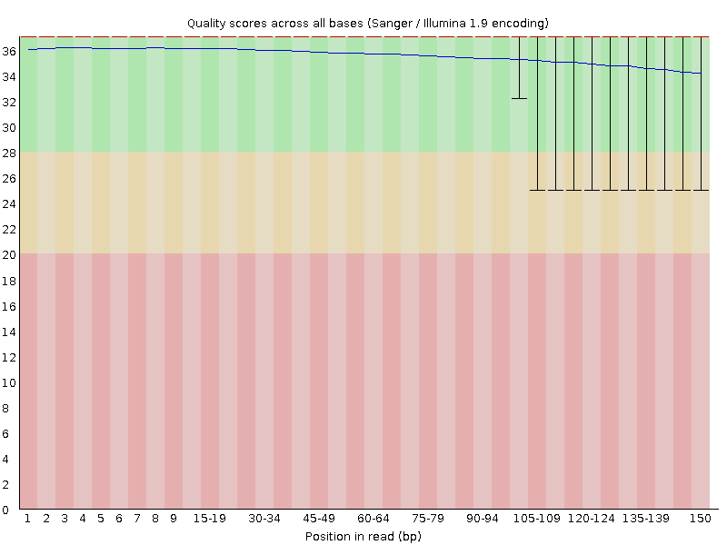

---
output:
  pdf_document: default
  html_document: default
---
# QAA Report

---
title: "PS2_report"
author: "Daraudom Nhem"
date: "07/09/25"
output:
  pdf_document:
    latex_engine: xelatex
---

## Part 1 - Read Quality Score Distribution

### Comparison of Demultipliex Code and FastQc

#### Fig1A.SRR25630302 (rhy51_EO_6cm) Per Base Quality Score Distribution Plots

| Generated Plot w/ Python Code | Generated Plot w/ FastQc |
|------------------------------------|------------------------------------|
|  |  |
|  |  |

#### Fig1B.SRR25630376 (comrhy114_EO_adult) Per Base Quality Score Distribution Plots

| Generated Plot w/ Python Code | Generated Plot w/ FastQc |
|------------------------------------|------------------------------------|
|  |  |
|  |  |

#### Thoughts

-   Quality Score Differences: My code-generated plot from the demultiplexing assignment matches with the fastqc plot distribution. Although the fastqc plot showed better color grading identifying regions of good or bad quality, our distribution are identical.
-   Memory/CPU Usage: Using `/usr/bin/time -v`, fastqc took 14:51 (mm:ss) to process all 4 files while using 106% of the CPU and having a maximum resident set size of 532420 kbytes. My code took 10:40.54 minutes, 199% cpu and 70484 kbytes to create the rhy51_EO_6cm quality score distribution, while the comrhy114_EO_adult quality score distribution took 8:25.49 minutes, 196% cpu and 69848 kbytes in memory. A key reason stems from the limitation that my script is only able to parse a set of paired reads one at time. Additionally, fastqc is a compiled, highly-optimized program that streams data making it more efficient even with just one core usage.

### Overall Data Quality of SRR25630302 and SRR25630376

## Part 2 - Adapter Trimming Comparison

### CutAdapter Results

Illumina Universal Adapters Used:

R1: `AGATCGGAAGAGCACACGTCTGAACTCCAGTCA`

R2: `AGATCGGAAGAGCGTCGTGTAGGGAAAGAGTGT`

| File (.fastq.gz)     | Total Reads Trimmed | Proportion of Reads Trimmed |
|----------------------|---------------------|-----------------------------|
| rhy51_EO_6cm_1       | 7,491,682           | 20.9%                       |
| rhy51_EO_6cm_2       | 7,589,557           | 21.2%                       |
| comrhy114_EO_adult_1 | 2,423,191           | 5.3%                        |
| comrhy114_EO_adult_2 | 2,746,276           | 6.1%                        |

### Trimmomatic Results

#### Summary Table

| Read_Pairs | Input Read Pairs | Surviving Read Pairs | Forward Only Surviving | Reverse Only Surviving | Dropped |
|------------|------------|------------|------------|------------|------------|
| SRR25630302 (rhy51_EO_6cm) | 45,365,378 | 44,820,566 (98.80%) | 352,919 (0.78%) | 172,523 (0.38%) | 19,370 (0.04%) |
| SRR25630376 (comrhy114_EO_adult) | 35,780,088 | 35,382,751 (98.89%) | 216,426 (0.60%) | 161,326 (0.45%) | 9585 (0.05%) |

#### Fig2A.Read Length Plot Distribution - SRR25630302 (rhy51_EO_6cm)


#### Fig2B.Read Length Plot Distribution - SRR25630376 (comrhy114_EO_adult)


In both species (comrhy114_EO_adult and rhy51_EO_6cm)), the read-length distributions for R1 and R2 largely overlap, indicating that Trimmomatic removed a comparable amount of sequence from each mate. The aligned peaks and similarly shaped tails suggest similar trimming extent and no obvious mate-specific bias. Our summary table also reported that both share similar surviving pairs (98.80% and 98.89% respectively).

## Part 3 - Alignment and Htseq-Count

### Mapped and Unmapped Counts

| File                             | #Mapped Reads | #Unmapped Reads |
|----------------------------------|---------------|-----------------|
| SRR25630302 (rhy51_EO_6cm)       | 38,760,798    | 7,835,586       |
| SRR25630376 (comrhy114_EO_adult) | 21,541,128    | 17,651,218      |

### Ht-seq Counts

| File                                      | Stranded? | Count    |
|-------------------------------------------|-----------|----------|
| rhy51_EO_6cm_rev_stranded_htseq.txt       | Reverse   | 13345540 |
| rhy51_EO_6cm_yes_stranded_htseq.txt       | Yes       | 920961   |
| comrhy114_EO_adult_rev_stranded_htseq.txt | Reverse   | 7271178  |
| comrhy114_EO_adult_yes_stranded_htseq.txt | Yes       | 515865   |

### Question 15

I wrote a strandedness test script to assess which `ht-seq` mode is a valid run. I counted each sample twice with htseq-count, using `--stranded=reverse` and `--stranded=yes`, then summed assigned reads (table above) and normalized by primary mapped reads (dividing by number of mapped reads from the mapped and unmapped table). For rhy51_EO_6cm, reverse assigned 13,345,540 (34.43%) vs 920,961 (2.38%) with yes (≈14.5× higher), and reduced \_\_no_feature from 36,011,820 to 13,505,725. For comrhy114_EO_adult, reverse assigned 7,271,178 (33.75%) vs 515,865 (2.39%) with yes (≈14.1× higher), and reduced \_\_no_feature from 19,642,350 to 8,175,274.

Evidence Outputted from Script:

```         
rhy51_EO_6cm    reverse_assigned        13345540        no_feature=13505725
rhy51_EO_6cm    yes_assigned    920961  no_feature=36011820
rhy51_EO_6cm    reverse_assigned_pct    34.43%
rhy51_EO_6cm    yes_assigned_pct        2.38%
comrhy114_EO_adult      reverse_assigned        7271178 no_feature=8175274
comrhy114_EO_adult      yes_assigned    515865  no_feature=19642350
comrhy114_EO_adult      reverse_assigned_pct    33.75%
comrhy114_EO_adult      yes_assigned_pct        2.39%
```

From these results and analyses, I concluded that the data are strand-specific, reverse-stranded.
