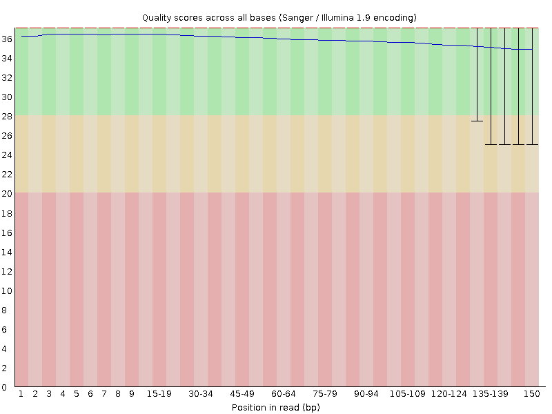
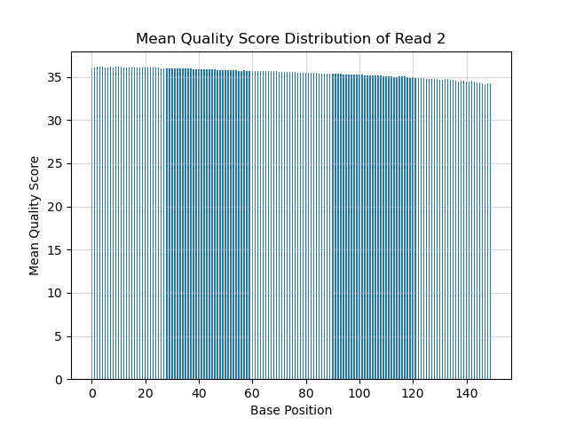
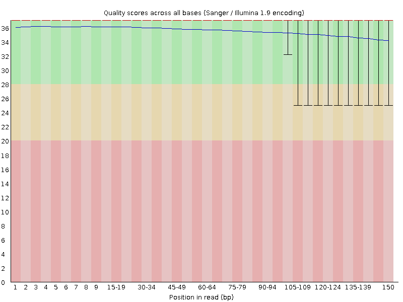
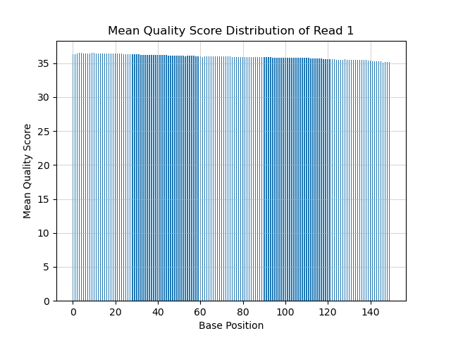
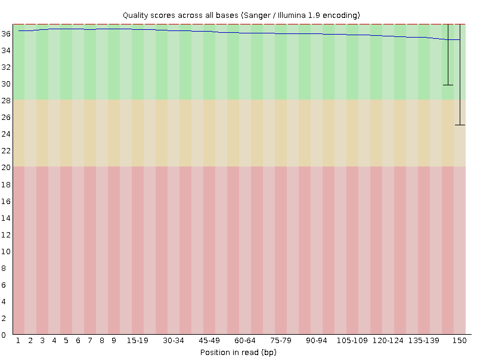
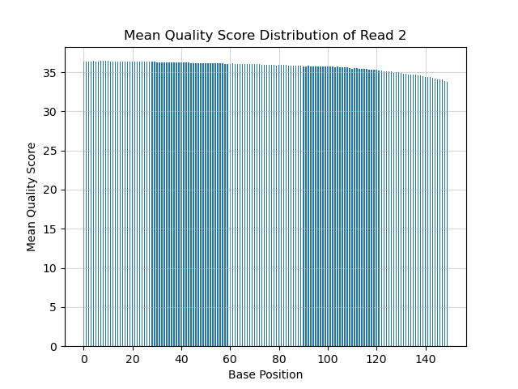
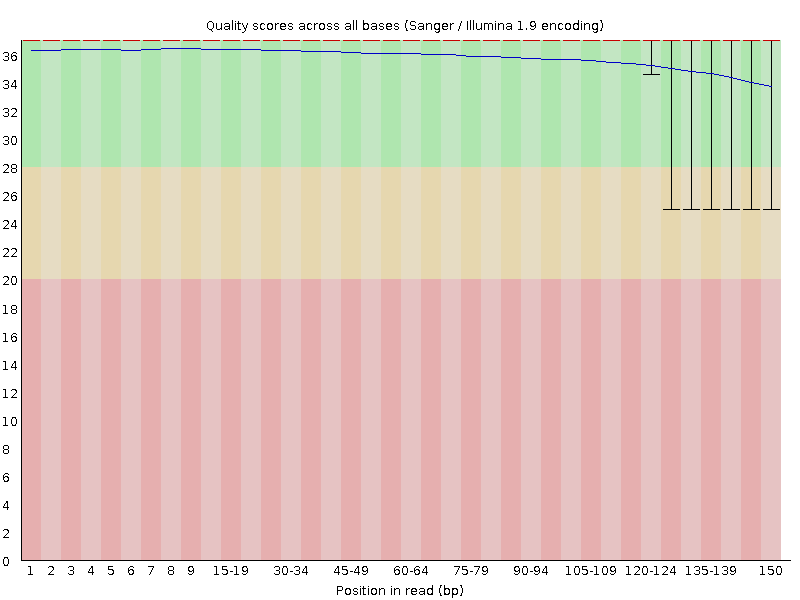
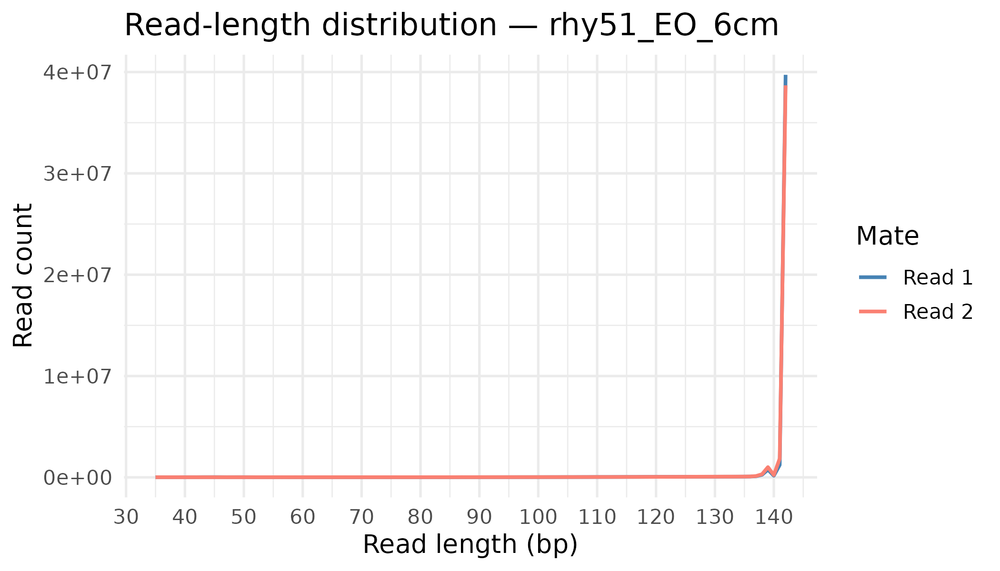
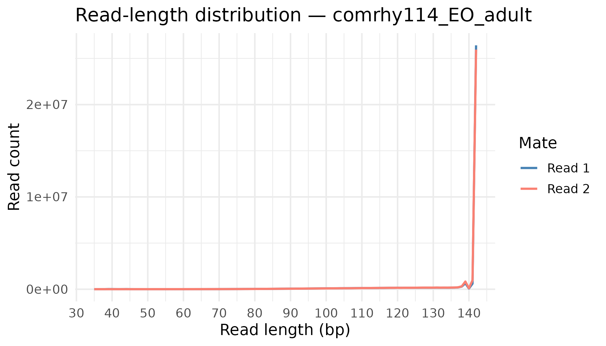

# QAA Report

---
title: "PS2_report"
author: "Daraudom Nhem"
output: pdf_document
date: "07/09/25"
---

## Part 1 - Read Quality Score Distribution

### Comparison of Demultipliex Code and FastQc

#### SRR25630302 (rhy51_EO_6cm) Per Base Quality Score Distribution Plots

| Generated Plot w/ Python Code | Generated Plot w/ FastQc |
|------------------------------------|------------------------------------|
|  |  |
|  |  |

: Comparison of FastQC Reports for SRR25630302

Include:

-   quality score differences?

-   plot distribution differences?

-   cpu/mem usage

#### SRR25630376 (comrhy114_EO_adult) Per Base Quality Score Distribution Plots

| Generated Plot w/ Python Code | Generated Plot w/ FastQc |
|------------------------------------|------------------------------------|
|  |  |
|  |  |

Comparison of FastQC Reports for comrhy114_EO_adult

Include:

quality score differences?

plot distribution differences?

cpu/mem usage

### Overall Data Quality of SRR25630302 and SRR25630376

## Part 2 - Adapter Trimming Comparison

### CutAdapter Results

Illumina Universal Adapters Used:

R1: `AGATCGGAAGAGCACACGTCTGAACTCCAGTCA`

R2: `AGATCGGAAGAGCGTCGTGTAGGGAAAGAGTGT`

| File (.fastq.gz)     | Total Reads Trimmed | Proportion of Reads Trimmed |
|----------------------|---------------------|-----------------------------|
| rhy51_EO_6cm_1       | 7,491,682           | 20.9%                       |
| rhy51_EO_6cm_2       | 7,589,557           | 21.2%                       |
| comrhy114_EO_adult_1 | 2,423,191           | 5.3%                        |
| comrhy114_EO_adult_2 | 2,746,276           | 6.1%                        |

### Trimmomatic Results

| Read_Pairs | Input Read Pairs | Surviving Read Pairs | Forward Only Surviving | Reverse Only Surviving | Dropped |
|------------|------------|------------|------------|------------|------------|
| SRR25630302 (rhy51_EO_6cm) | 45,365,378 | 44,820,566 (98.80%) | 352,919 (0.78%) | 172,523 (0.38%) | 19,370 (0.04%) |
| SRR25630376 (comrhy114_EO_adult) | 35,780,088 | 35,382,751 (98.89%) | 216,426 (0.60%) | 161,326 (0.45%) | 9585 (0.05%) |

#### Read Length Plot Distribution - SRR25630302 (rhy51_EO_6cm)

#### Read Length Plot Distribution - SRR25630376 (comrhy114_EO_adult)

## Part 3 - Alignemnt and Htseq-Count

### Mapped and Unmapped Counts

| File                             | #Mapped Reads | #Unmapped Reads |
|----------------------------------|---------------|-----------------|
| SRR25630302 (rhy51_EO_6cm)       | 38,760,798    | 7,835,586       |
| SRR25630376 (comrhy114_EO_adult) | 21,541,128    | 17,651,218      |

### Ht-seq Counts

| File                                      | Stranded? | Count    |
|-------------------------------------------|-----------|----------|
| rhy51_EO_6cm_rev_stranded_htseq.txt       | Reverse   | 13345540 |
| rhy51_EO_6cm_yes_stranded_htseq.txt       | Yes       | 920961   |
| comrhy114_EO_adult_rev_stranded_htseq.txt | Reverse   | 7271178  |
| comrhy114_EO_adult_yes_stranded_htseq.txt | Yes       | 515865   |
